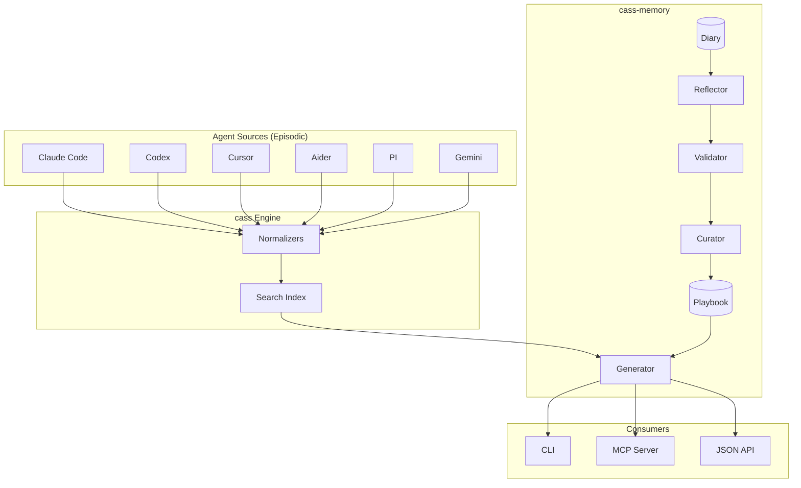

# cass-memory


**Procedural memory for AI coding agents.**
Transforms scattered agent sessions into persistent, cross-agent memory—so every agent learns from every other agent's experience.

<div align="center">

**One-liner install (Linux/macOS):**

```bash
curl -fsSL "https://raw.githubusercontent.com/Dicklesworthstone/cass_memory_system/main/install.sh?$(date +%s)" \
  | bash -s -- --easy-mode --verify
```

**Or via package managers:**

```bash
# macOS/Linux (Homebrew)
brew install dicklesworthstone/tap/cm

# Windows (Scoop)
scoop bucket add dicklesworthstone https://github.com/Dicklesworthstone/scoop-bucket
scoop install dicklesworthstone/cm
```

</div>

---

## 🤖 Agent Quickstart (JSON)

**Always use `--json` in agent contexts.** stdout = data, stderr = diagnostics, exit 0 = success.

```bash
# 1) Get task-specific memory before you start
cm context "implement auth rate limiting" --json

# 2) See the minimum viable workflow
cm quickstart --json

# 3) Build the playbook (memory onboarding)
cm onboard status --json
cm onboard sample --fill-gaps --json
cm onboard read /path/to/session.jsonl --template --json
cm onboard mark-done /path/to/session.jsonl
```

## Table of Contents

- [Why This Exists](#-why-this-exists)
- [How It Works](#-how-it-works)
- [Key Features](#-key-features)
- [For AI Agents](#-for-ai-agents-the-most-important-section)
- [Installation](#-installation)
- [CLI Reference](#-cli-reference)
- [The ACE Pipeline](#-the-ace-pipeline)
- [Data Models](#-data-models)
- [Scoring Algorithm](#-scoring-algorithm)
- [Configuration](#-configuration)
- [MCP Server](#-mcp-server)
- [Architecture & Engineering](#-architecture--engineering)
- [Deep Dive: Core Algorithms](#-deep-dive-core-algorithms)
- [Privacy & Security](#-privacy--security)
- [Trauma Guard: Safety System](#-trauma-guard-safety-system)
- [Performance Characteristics](#-performance-characteristics)
- [Starter Playbooks](#-starter-playbooks)
- [Extensibility](#-extensibility-adding-new-components)
- [Troubleshooting](#-troubleshooting)
- [Design Philosophy](#-design-philosophy)
- [Comparison with Alternatives](#-comparison-with-alternatives)
- [Roadmap](#-roadmap)

---

## 💡 Why This Exists

### The Problem

AI coding agents accumulate valuable knowledge through sessions: debugging strategies, code patterns, user preferences, project-specific insights. But this knowledge is:

1. **Trapped in sessions** — Each session ends, context is lost forever
2. **Agent-specific** — Claude Code doesn't know what Cursor learned yesterday
3. **Unstructured** — Raw conversation logs aren't actionable as guidance
4. **Subject to collapse** — Naive summarization loses critical nuances and details

You've solved authentication bugs three times this month across different agents. Each time, you started from scratch because the knowledge from previous sessions was inaccessible.

### The Solution

`cass-memory` implements a **three-layer cognitive architecture** that transforms raw session logs into actionable, confidence-tracked rules:

| Layer | Role | Implementation |
|-------|------|----------------|
| **Episodic Memory** | Raw ground truth from all agents | `cass` search engine |
| **Working Memory** | Structured session summaries | Diary entries |
| **Procedural Memory** | Distilled rules with tracking | Playbook bullets |

This mirrors how human expertise develops: raw experiences (episodic) are consolidated into structured memories (working), which eventually become automatic knowledge (procedural).

### Who Benefits

- **AI Agents**: Get relevant rules and historical context before starting any task
- **Developers**: Build institutional memory that persists across tools and sessions
- **Teams**: Share patterns discovered by any team member's AI assistant
- **Power Users**: Create sophisticated workflows that leverage cross-agent learning

---

## 🔄 How It Works

```
┌─────────────────────────────────────────────────────────────────────┐
│                    EPISODIC MEMORY (cass)                           │
│   Raw session logs from all agents — the "ground truth"             │
│   Claude Code │ Codex │ Cursor │ Aider │ PI │ Gemini │ ChatGPT │ ... │
└───────────────────────────┬─────────────────────────────────────────┘
                            │ cass search
                            ▼
┌─────────────────────────────────────────────────────────────────────┐
│                    WORKING MEMORY (Diary)                           │
│   Structured session summaries bridging raw logs to rules           │
│   accomplishments │ decisions │ challenges │ outcomes               │
└───────────────────────────┬─────────────────────────────────────────┘
                            │ reflect + curate (automated)
                            ▼
┌─────────────────────────────────────────────────────────────────────┐
│                    PROCEDURAL MEMORY (Playbook)                     │
│   Distilled rules with confidence tracking                          │
│   Rules │ Anti-patterns │ Feedback │ Decay                          │
└─────────────────────────────────────────────────────────────────────┘
```

Every agent's sessions feed the shared memory. A pattern discovered in Cursor **automatically** helps Claude Code on the next session.

---

## ✨ Key Features

### Cross-Agent Learning

Sessions from all your AI coding agents feed a unified knowledge base:

```
Claude Code session    →  ┐
Cursor session         →  │→  Unified Playbook  →  All agents benefit
Codex session          →  │
Aider session          →  │
PI session             →  ┘
```

A debugging technique discovered in Cursor is immediately available to Claude Code. No manual knowledge transfer required.

### Confidence Decay System

Rules aren't immortal. A rule helpful 8 times in January but never validated since loses confidence over time:

- **90-day half-life**: Confidence halves every 90 days without revalidation
- **4x harmful multiplier**: One mistake counts 4× as much as one success
- **Maturity progression**: `candidate` → `established` → `proven`

This prevents stale rules from polluting your playbook while rewarding consistently helpful guidance.

### Anti-Pattern Learning

Bad rules don't just get deleted—they become **warnings**:

```
"Cache auth tokens for performance"
    ↓ (3 harmful marks)
"PITFALL: Don't cache auth tokens without expiry validation"
```

When a rule is marked harmful multiple times, it's automatically inverted into an anti-pattern that warns future agents away from the same mistake.

### Scientific Validation

New rules aren't blindly accepted. Before a rule joins your playbook, it's validated against your cass history:

```
Proposed rule: "Always check token expiry before auth debugging"
    ↓
Evidence gate: Search cass for sessions where this applied
    ↓
Result: 5 sessions found, 4 successful outcomes → ACCEPT
```

Rules without historical evidence are flagged as candidates until proven.

### Graceful Degradation

The system works even when components are missing:

| Condition | Behavior |
|-----------|----------|
| No cass | Playbook-only scoring, no history snippets |
| No playbook | Empty playbook, commands still work |
| No LLM | Deterministic reflection, no semantic enhancement |
| Offline | Cached playbook + local diary |

You always get value, even in degraded conditions.

---

## 🤖 For AI Agents: The Most Important Section

`cass-memory` is designed **specifically** for AI coding agents—not just as an afterthought, but as a first-class design goal. When you're an AI agent working on a codebase, cross-agent memory becomes invaluable: rules learned by other agents, context about design decisions, debugging approaches that worked, and institutional memory that would otherwise be lost.

### Why Cross-Agent Memory Matters

Imagine you're Claude Code working on a React authentication bug. With `cass-memory`, you can instantly access:
- Rules extracted from previous Claude sessions about auth patterns
- Debugging strategies discovered by Cursor last week
- Anti-patterns identified when Codex hit the same issue
- Historical context from Aider about the codebase's auth architecture

This cross-pollination of knowledge across different AI agents is transformative. Each agent has different strengths, different context windows, and encounters different problems. `cass-memory` unifies all this collective intelligence into a single, searchable, actionable knowledge base.

### The One Command You Need

```bash
cm context "<your task>" --json
```

**Run this command before starting any non-trivial task.** It returns:
- **Relevant rules** from the playbook (scored by task relevance)
- **Historical context** from past sessions (yours and other agents')
- **Anti-patterns** to avoid (things that have caused problems)
- **Suggested searches** for deeper investigation

### Self-Documenting API

`cass-memory` teaches agents how to use it—no external documentation required:

```bash
# Quick capability check and self-explanation
cm quickstart --json
# → Returns complete explanation of the system and how to use it

# System health and available features
cm doctor --json
# → { checks: [...], recommendations: [...], ... }

# Get relevant context for a task
cm context "implement user authentication" --json
# → { relevantBullets: [...], antiPatterns: [...], historySnippets: [...] }
```

### Structured Output Format

Every command supports `--json` for machine-readable output:

```bash
cm context "fix the auth timeout bug" --json
```

```json
{
  "success": true,
  "task": "fix the auth timeout bug",
  "relevantBullets": [
    {
      "id": "b-8f3a2c",
      "content": "Always check token expiry before other auth debugging",
      "effectiveScore": 8.5,
      "maturity": "proven",
      "relevanceScore": 0.92,
      "reasoning": "Extracted from 5 successful sessions"
    }
  ],
  "antiPatterns": [
    {
      "id": "b-x7k9p1",
      "content": "Don't cache auth tokens without expiry validation",
      "effectiveScore": 3.2
    }
  ],
  "historySnippets": [
    {
      "source_path": "~/.claude/sessions/session-001.jsonl",
      "agent": "claude",
      "origin": { "kind": "local" },
      "snippet": "Fixed timeout by increasing token refresh interval...",
      "score": 0.87
    }
  ],
  "suggestedCassQueries": [
    "cass search 'authentication timeout' --robot --days 30"
  ],
  "degraded": null
}
```

**Design principle**: stdout contains only parseable JSON data; all diagnostics go to stderr.

**Filtering remote vs local history:** `historySnippets[].origin.kind` is `"local"` or `"remote"`; remote hits include `origin.host`.

### Error Handling for Agents

Errors are structured and include recovery hints:

```json
{
  "success": false,
  "code": "PLAYBOOK_NOT_FOUND",
  "error": "Playbook file not found at ~/.cass-memory/playbook.yaml",
  "hint": "Run 'cm init' to create a new playbook",
  "retryable": false
}
```

### Token Budget Management

AI agents have context limits. `cass-memory` provides controls to manage output size:

| Flag | Effect |
|------|--------|
| `--limit N` | Cap number of rules returned |
| `--min-score N` | Only return rules above score threshold |
| `--no-history` | Skip historical snippets (faster, smaller) |
| `--json` | Structured output for parsing |

### Inline Feedback (During Work)

When a rule helps or hurts during your work, leave inline feedback:

```typescript
// [cass: helpful b-8f3a2c] - this rule saved me from a rabbit hole

// [cass: harmful b-x7k9p1] - this advice was wrong for our use case
```

These comments are automatically parsed during reflection and update rule confidence.

### Session Outcome Recording

After completing a task, record the outcome:

```bash
# Record successful outcome (positional: status, rules)
cm outcome success b-8f3a2c,b-xyz789 --summary "Fixed auth bug"

# Record failure
cm outcome failure b-x7k9p1 --summary "Rule led to wrong approach"

# Apply recorded outcomes to playbook
cm outcome-apply
```

### What NOT to Do

You do NOT need to:
- Run `cm reflect` (automation handles this)
- Run `cm mark` manually (use inline comments instead)
- Manually add rules to the playbook
- Worry about the learning pipeline

The system learns from your sessions automatically. Your job is just to **query context before working**.

### Ready-to-Paste Blurb for AGENTS.md / CLAUDE.md

```markdown
## Memory System: cass-memory

The Cass Memory System (cm) is a tool for giving agents an effective memory based on the ability to quickly search across previous coding agent sessions across an array of different coding agent tools (e.g., Claude Code, Codex, Gemini-CLI, Cursor, etc) and projects (and even across multiple machines, optionally) and then reflect on what they find and learn in new sessions to draw out useful lessons and takeaways; these lessons are then stored and can be queried and retrieved later, much like how human memory works.

The `cm onboard` command guides you through analyzing historical sessions and extracting valuable rules.

### Quick Start

```bash
# 1. Check status and see recommendations
cm onboard status

# 2. Get sessions to analyze (filtered by gaps in your playbook)
cm onboard sample --fill-gaps

# 3. Read a session with rich context
cm onboard read /path/to/session.jsonl --template

# 4. Add extracted rules (one at a time or batch)
cm playbook add "Your rule content" --category "debugging"
# Or batch add:
cm playbook add --file rules.json

# 5. Mark session as processed
cm onboard mark-done /path/to/session.jsonl
```

Before starting complex tasks, retrieve relevant context:

```bash
cm context "<task description>" --json
```

This returns:
- **relevantBullets**: Rules that may help with your task
- **antiPatterns**: Pitfalls to avoid
- **historySnippets**: Past sessions that solved similar problems
- **suggestedCassQueries**: Searches for deeper investigation

### Protocol

1. **START**: Run `cm context "<task>" --json` before non-trivial work
2. **WORK**: Reference rule IDs when following them (e.g., "Following b-8f3a2c...")
3. **FEEDBACK**: Leave inline comments when rules help/hurt:
   - `// [cass: helpful b-xyz] - reason`
   - `// [cass: harmful b-xyz] - reason`
4. **END**: Just finish your work. Learning happens automatically.

### Key Flags

| Flag | Purpose |
|------|---------|
| `--json` | Machine-readable JSON output (required!) |
| `--limit N` | Cap number of rules returned |
| `--no-history` | Skip historical snippets for faster response |

stdout = data only, stderr = diagnostics. Exit 0 = success.
```

---

## 🎓 Agent-Native Onboarding

Building a playbook from scratch can be daunting—but you don't need to spend money on LLM API calls to do it. The **agent-native onboarding** system leverages the AI coding agent you're already paying for (via Claude Max, ChatGPT Pro, Cursor Pro, etc.) to analyze historical sessions and extract rules.

### The Zero-Cost Approach

Traditional approaches to building a playbook might suggest using external LLM APIs to analyze sessions and extract rules. But if you're already running an AI coding agent, **that agent can do the analysis work itself**—at no additional cost.

```
Traditional approach:
  Sessions → External LLM API → Rules → $ cost per session

Agent-native approach:
  Sessions → Your Agent (already paid for) → Rules → $0 additional cost
```

The `cm onboard` command guides your agent through analyzing historical sessions and extracting valuable rules.

### Quick Start

```bash
# 1. Check status and see recommendations
cm onboard status

# 2. Get sessions to analyze (filtered by gaps in your playbook)
cm onboard sample --fill-gaps

# 3. Read a session with rich context
cm onboard read /path/to/session.jsonl --template

# 4. Add extracted rules (one at a time or batch)
cm playbook add "Your rule content" --category "debugging"
# Or batch add:
cm playbook add --file rules.json

# 5. Mark session as processed
cm onboard mark-done /path/to/session.jsonl
```

### Gap Analysis

Not all playbook categories are equally represented. The gap analysis system identifies **underrepresented categories** so you can prioritize which sessions to analyze.

**Categories tracked:**
- `debugging` — Error resolution, bug fixing, tracing
- `testing` — Unit tests, mocks, assertions, coverage
- `architecture` — Design patterns, module structure, abstractions
- `workflow` — Task management, CI/CD, deployment
- `documentation` — Comments, READMEs, API docs
- `integration` — APIs, HTTP, JSON parsing, endpoints
- `collaboration` — Code review, PRs, team coordination
- `git` — Version control, branching, merging
- `security` — Auth, encryption, vulnerability prevention
- `performance` — Optimization, caching, profiling

**Category status thresholds:**
| Status | Rule Count | Priority |
|--------|------------|----------|
| `critical` | 0 rules | High |
| `underrepresented` | 1-2 rules | Medium |
| `adequate` | 3-10 rules | Low |
| `well-covered` | 11+ rules | None |

```bash
# View detailed gap analysis
cm onboard gaps

# Sample sessions prioritized for gap-filling
cm onboard sample --fill-gaps
```

### Progress Tracking

Onboarding progress persists across sessions, so agents can resume where they left off even after context window limits are reached.

**State stored at:** `~/.cass-memory/onboarding-state.json`

```json
{
  "version": 1,
  "startedAt": "2025-01-15T10:30:00Z",
  "lastUpdatedAt": "2025-01-15T14:45:00Z",
  "processedSessions": [
    {
      "path": "/Users/x/.claude/sessions/session-001.jsonl",
      "processedAt": "2025-01-15T11:00:00Z",
      "rulesExtracted": 3
    }
  ],
  "stats": {
    "totalSessionsProcessed": 5,
    "totalRulesExtracted": 12
  }
}
```

Commands for progress management:
```bash
# Check progress
cm onboard status

# Mark a session as done (even if no rules extracted)
cm onboard mark-done /path/to/session.jsonl

# Reset progress to start fresh
cm onboard reset
```

### Batch Rule Addition

After analyzing a session, add multiple rules at once using the batch add feature:

```bash
# Create a JSON file with rules
cat > rules.json << 'EOF'
[
  {"content": "Always run tests before committing", "category": "testing"},
  {"content": "Check token expiry before auth debugging", "category": "debugging"},
  {"content": "AVOID: Mocking entire modules in tests", "category": "testing"}
]
EOF

# Add all rules at once
cm playbook add --file rules.json

# Or pipe from another command
echo '[{"content": "Rule from stdin", "category": "workflow"}]' | cm playbook add --file -

# Track which session the rules came from
cm playbook add --file rules.json --session /path/to/session.jsonl
```

The `--session` flag automatically updates onboarding progress, crediting the session with the number of rules extracted.

### Template Output for Rich Context

The `--template` flag provides agents with rich contextual information to guide extraction:

```bash
cm onboard read /path/to/session.jsonl --template --json
```

**Template output includes:**

```json
{
  "metadata": {
    "path": "/path/to/session.jsonl",
    "workspace": "/Users/x/project",
    "messageCount": 127,
    "topicHints": ["debugging", "testing", "git"]
  },
  "context": {
    "relatedRules": [
      {"id": "b-abc123", "content": "...", "similarity": 0.72}
    ],
    "playbookGaps": {
      "critical": ["security", "performance"],
      "underrepresented": ["collaboration"]
    },
    "suggestedFocus": "This session may contain security patterns - you have NO rules in this area!"
  },
  "extractionFormat": {
    "schema": {"content": "string", "category": "string"},
    "categories": ["debugging", "testing", "architecture", ...],
    "examples": [...]
  },
  "sessionContent": "..."
}
```

**Template features:**
- **Topic hints**: Categories detected from session content using keyword matching
- **Related rules**: Existing playbook rules similar to the session content (via semantic search if enabled)
- **Playbook gaps**: Categories with missing or few rules
- **Suggested focus**: AI-generated guidance on what to prioritize based on gaps and detected topics
- **Examples**: Sample rules showing proper format for each category

### Gap-Targeted Sampling Algorithm

When using `--fill-gaps`, the sampling algorithm prioritizes sessions likely to contain patterns for underrepresented categories:

```
1. Analyze playbook → Identify critical/underrepresented categories
2. Generate search queries from category keywords:
   - "security" → "security auth token"
   - "performance" → "performance optimize cache"
3. Search cass with gap-targeted queries
4. Score each session against gaps:
   - Session matches critical category: +3 points
   - Session matches underrepresented category: +2 points
   - Session matches adequate category: +1 point
5. Sort sessions by gap score (highest first)
6. Filter out already-processed sessions
7. Return top N sessions
```

**Category keyword detection** uses a lightweight approach (no external APIs required):

```typescript
// Example: detecting categories from text
const CATEGORY_KEYWORDS = {
  debugging: ["debug", "error", "fix", "bug", "trace", "stack", ...],
  testing: ["test", "mock", "assert", "expect", "jest", "vitest", ...],
  security: ["security", "auth", "token", "encrypt", "permission", ...],
  // ... more categories
};

// Count keyword matches → category with most matches wins
```

### Targeted Sampling Options

Filter sessions by various criteria to focus on specific areas:

```bash
# Filter by workspace/project
cm onboard sample --workspace /Users/x/my-project

# Filter by agent
cm onboard sample --agent claude
cm onboard sample --agent cursor

# Filter by recency
cm onboard sample --days 30

# Combine filters
cm onboard sample --agent claude --days 14 --workspace /Users/x/api-project

# Include already-processed sessions (for re-analysis)
cm onboard sample --include-processed

# Adjust sample size
cm onboard sample --limit 20
```

### Onboarding Workflow for Agents

Recommended protocol for AI agents doing onboarding:

```markdown
## Onboarding Protocol

### Phase 1: Assessment
1. Run `cm onboard status --json` to check current progress
2. Run `cm onboard gaps --json` to see category distribution
3. Decide target: ~20 rules across diverse categories for a good initial playbook

### Phase 2: Session Analysis Loop
For each session until target reached:
1. `cm onboard sample --fill-gaps --json` → get prioritized sessions
2. `cm onboard read <path> --template --json` → get session with context
3. Analyze session content, identify 2-5 reusable patterns
4. Format as rules following extraction guidelines
5. `cm playbook add --file rules.json --session <path>` → add rules
6. Repeat with next session

### Phase 3: Verification
1. `cm onboard status` → verify progress
2. `cm onboard gaps` → check remaining gaps
3. `cm stats --json` → verify playbook health
```

### Why Agent-Native Onboarding?

1. **Zero additional cost**: Uses the AI agent you're already paying for
2. **Better analysis**: Your agent understands your codebase context
3. **Resumable**: Progress persists across sessions
4. **Gap-aware**: Automatically prioritizes underrepresented categories
5. **Batch-friendly**: Add multiple rules efficiently
6. **Self-documenting**: Template output guides extraction

---

## 📦 Installation

### One-Liner (Recommended)

#### Recommended: Homebrew (macOS/Linux)

```bash
brew install dicklesworthstone/tap/cm
```

This method provides:
- Automatic updates via `brew upgrade`
- Dependency management
- Easy uninstall via `brew uninstall`

#### Windows: Scoop

```powershell
scoop bucket add dicklesworthstone https://github.com/Dicklesworthstone/scoop-bucket
scoop install dicklesworthstone/cm
```

#### Alternative: Install Script

**Linux/macOS:**
```bash
curl -fsSL "https://raw.githubusercontent.com/Dicklesworthstone/cass_memory_system/main/install.sh?$(date +%s)" \
  | bash -s -- --easy-mode --verify
```

**Direct Downloads:**
- [Linux x64](https://github.com/Dicklesworthstone/cass_memory_system/releases/latest/download/cass-memory-linux-x64)
- [macOS Apple Silicon](https://github.com/Dicklesworthstone/cass_memory_system/releases/latest/download/cass-memory-macos-arm64)
- [macOS Intel](https://github.com/Dicklesworthstone/cass_memory_system/releases/latest/download/cass-memory-macos-x64)
- [Windows x64](https://github.com/Dicklesworthstone/cass_memory_system/releases/latest/download/cass-memory-windows-x64.exe)

### Installer Options

```bash
# Full options
install.sh [--version vX.Y.Z] [--dest DIR] [--system] [--easy-mode] [--verify]
           [--from-source] [--quiet]

# Examples
install.sh --version v0.2.2 --verify    # Specific version
install.sh --system --verify             # Install to /usr/local/bin (requires sudo)
install.sh --from-source                 # Build from source (requires bun)
```

| Flag | Effect |
|------|--------|
| `--version` | Install specific version (default: latest) |
| `--dest DIR` | Install to custom directory (default: ~/.local/bin) |
| `--system` | Install to /usr/local/bin (requires sudo) |
| `--easy-mode` | Non-interactive, auto-configure PATH |
| `--verify` | Run self-test after install |
| `--from-source` | Build from source instead of downloading binary |
| `--quiet` | Suppress output |

### Installer Robustness

The installer is designed for reliability:

- **No API rate limits**: Uses GitHub redirect detection instead of API calls, avoiding the 60 requests/hour unauthenticated limit
- **Checksum verification**: Downloads `.sha256` files and verifies binary integrity before installation
- **Concurrent install protection**: Lock file prevents multiple installers from running simultaneously
- **Graceful fallbacks**: If binary download fails, automatically falls back to building from source
- **Cross-platform checksums**: Uses `sha256sum` on Linux, `shasum -a 256` on macOS

### From Source

```bash
git clone https://github.com/Dicklesworthstone/cass_memory_system.git
cd cass_memory_system
bun install
bun run build
sudo mv ./dist/cass-memory /usr/local/bin/cm
```

### Prerequisites

- **cass CLI**: The episodic memory layer. Install from [cass repo](https://github.com/Dicklesworthstone/coding_agent_session_search)
- **LLM API Key** (optional): For AI-powered reflection. Set `ANTHROPIC_API_KEY`, `OPENAI_API_KEY`, or `GOOGLE_GENERATIVE_AI_API_KEY`

### Verify Installation

```bash
cm --version
cm doctor --json
```

### Initial Setup

```bash
# Initialize (creates global config and playbook)
cm init

# Or with a starter playbook for common patterns
cm init --starter typescript  # or: react, python, go
cm starters  # list available starters
```

### Automating Reflection

The key to the system is automated reflection. Set up a cron job or hook:

```bash
# Daily reflection on recent sessions
cm reflect --days 7 --json

# Via cron (runs at 2am daily)
0 2 * * * /usr/local/bin/cm reflect --days 7 >> ~/.cass-memory/reflect.log 2>&1
```

For Claude Code users, add a post-session hook in `.claude/hooks.json`:
```json
{
  "post-session": ["cm reflect --days 1"]
}
```

---

## 🛠️ CLI Reference

### Quick Reference Table

| Command | Purpose | Agent Use |
|---------|---------|-----------|
| `cm context "<task>" --json` | Get rules + history for task | **Primary** |
| `cm quickstart --json` | Self-documentation | Setup |
| `cm doctor --json` | System health check | Diagnostics |
| `cm playbook list` | Show all rules | Inspection |
| `cm similar "<query>"` | Find similar rules | Search |
| `cm stats --json` | Playbook metrics | Analytics |
| `cm trauma list` | Show dangerous patterns | Safety |
| `cm guard --status` | Check safety hook status | Safety |

### Error Output & Exit Codes

When `--json` (or `--format json`) is enabled, errors are printed to stdout as a single JSON object:

```json
{
  "success": false,
  "error": "…",
  "code": "…",
  "exitCode": 2,
  "recovery": ["…", "…"],
  "cause": "…",
  "docs": "README.md#-troubleshooting",
  "hint": "…",
  "details": {}
}
```

Exit codes are categorized for scripting:

- `1` internal (bug / unexpected)
- `2` user input / usage
- `3` configuration
- `4` filesystem
- `5` network
- `6` cass
- `7` LLM/provider

### Agent Commands (Primary Workflow)

```bash
# Get context before starting a task (THE MAIN COMMAND)
cm context "implement user authentication" --json

# Self-documenting explanation of the system
cm quickstart --json

# Find rules similar to a query
cm similar "error handling best practices"
```

### Playbook Commands (Inspect & Manage Rules)

```bash
# List all active rules
cm playbook list

# Get detailed info for a specific rule
cm playbook get b-8f3a2c

# Add a new rule manually
cm playbook add "Always run tests before committing"

# Remove/deprecate a rule
cm playbook remove b-xyz789 --reason "No longer applicable"

# Export playbook for backup or sharing
cm playbook export > playbook-backup.yaml

# Import playbook from file
cm playbook import shared-playbook.yaml

# Show top N most effective rules
cm top 10

# Find rules without recent feedback (stale)
cm stale --days 60

# Show why a rule exists (provenance)
cm why b-8f3a2c

# Get playbook health metrics
cm stats --json
```

### Learning Commands (Feedback & Reflection)

```bash
# Process recent sessions into rules (usually automated)
cm reflect --days 7 --json

# Manual feedback on a rule
cm mark b-8f3a2c --helpful
cm mark b-xyz789 --harmful --reason "Caused regression"

# Record session outcome (positional: status, rules)
cm outcome success b-8f3a2c,b-def456
cm outcome failure b-x7k9p1 --summary "Auth approach failed"

# Apply recorded outcomes to playbook
cm outcome-apply

# Validate a proposed rule against history
cm validate "Always check null before dereferencing"

# Deprecate a rule permanently
cm forget b-xyz789 --reason "Superseded by better pattern"

# Revert a curation decision
cm undo b-xyz789

# Check sessions for rule violations
cm audit --days 30
```

### System Commands (Setup & Diagnostics)

```bash
# Initialize configuration and playbook
cm init
cm init --starter typescript  # With starter template
cm starters                   # List available starters

# Check system health
cm doctor --json
cm doctor --fix               # Auto-fix issues

# Export rules for AGENTS.md
cm project --format agents.md

# Show LLM cost and usage statistics
cm usage

# Run MCP HTTP server for agent integration (default: 127.0.0.1:8765)
cm serve

# Privacy controls
cm privacy status
cm privacy enable   # Enable cross-agent enrichment
cm privacy disable  # Disable cross-agent enrichment
```

### Safety Commands (Trauma Guard)

```bash
# View active trauma patterns
cm trauma list

# Add a dangerous pattern
cm trauma add "DROP TABLE" --description "Database table deletion" --severity critical

# Temporarily disable a pattern
cm trauma heal t-abc123 --reason "Intentional migration cleanup"

# Permanently remove a pattern
cm trauma remove t-abc123

# Scan sessions for potential traumas
cm trauma scan --days 30

# Import patterns from file
cm trauma import shared-traumas.yaml

# Install safety hooks
cm guard --install           # Claude Code pre-tool hook
cm guard --git               # Git pre-commit hook
cm guard --install --git     # Both
cm guard --status            # Check installation status
```

### Command Output Modes

All commands support multiple output formats:

| Flag | Output |
|------|--------|
| (default) | Human-readable text |
| `--json` | Machine-readable JSON |
| `--quiet` | Minimal output |

---

## 🔬 The ACE Pipeline

`cass-memory` implements the **Agentic Context Engineering (ACE)** framework with four stages:

```
┌──────────────┐     ┌──────────────┐     ┌──────────────┐     ┌──────────────┐
│  GENERATOR   │ ──▶ │  REFLECTOR   │ ──▶ │  VALIDATOR   │ ──▶ │   CURATOR    │
│              │     │              │     │              │     │              │
│ Pre-task     │     │ LLM pattern  │     │ Evidence     │     │ Deterministic│
│ context      │     │ extraction   │     │ gate against │     │ delta merge  │
│ hydration    │     │ from diary   │     │ cass history │     │ (NO LLM!)    │
└──────────────┘     └──────────────┘     └──────────────┘     └──────────────┘
```

### Stage 1: Generator (`cm context`)

Hydrates the agent with relevant rules before starting a task.

**Implementation** (`src/commands/context.ts`):

```typescript
async function generateContext(task: string): Promise<ContextResult> {
  // 1. Extract keywords from task
  const keywords = extractKeywords(task);

  // 2. Score all playbook bullets against keywords
  const scoredBullets = playbook.bullets
    .map(bullet => ({
      ...bullet,
      relevanceScore: scoreRelevance(bullet, keywords),
      effectiveScore: getEffectiveScore(bullet)
    }))
    .filter(b => b.relevanceScore > config.minRelevanceScore)
    .sort((a, b) => b.relevanceScore * b.effectiveScore - a.relevanceScore * a.effectiveScore);

  // 3. Search cass for historical context
  const historySnippets = await safeCassSearch(task, {
    limit: config.maxHistoryInContext,
    days: config.sessionLookbackDays
  });

  // 4. Return ranked results
  return {
    task,
    relevantBullets: scoredBullets.slice(0, config.maxBulletsInContext),
    antiPatterns: scoredBullets.filter(b => b.type === 'anti-pattern'),
    historySnippets,
    suggestedCassQueries: generateSuggestedQueries(task, keywords)
  };
}
```

### Stage 2: Reflector (`cm reflect`)

Processes unprocessed sessions to extract new rules.

**How It Works**:

1. **Find unprocessed sessions** via cass timeline API
2. **Generate diary entries** - structured summaries of each session:
   - Accomplishments (what was completed)
   - Decisions (design choices made)
   - Challenges (problems encountered)
   - Key learnings (reusable insights)
3. **Run LLM reflector** - multi-iteration pattern extraction
4. **Output deltas** - add/helpful/harmful/deprecate operations

**The Reflector Prompt** (simplified):

```
Analyze this session diary and extract actionable rules.
For each pattern you identify:
1. Formulate as an imperative rule ("Always...", "Never...", "When X, do Y")
2. Categorize (testing, debugging, git, architecture, etc.)
3. Assess scope (global, workspace, language, framework)
4. Provide reasoning for why this is valuable

Output format: JSON array of proposed rules
```

### Stage 3: Validator

Scientific gate ensuring rules have evidence.

**Implementation** (`src/ace/validator.ts`):

```typescript
async function validateRule(rule: ProposedRule): Promise<ValidationResult> {
  // 1. Evidence count gate - fast pre-filter
  const evidenceCount = await countEvidenceInCass(rule);
  if (evidenceCount < MIN_EVIDENCE_COUNT) {
    return { verdict: 'NEEDS_MORE_EVIDENCE', evidenceCount };
  }

  // 2. LLM validation - deep analysis
  const llmVerdict = await llmValidate(rule, evidenceCount);

  // 3. Final verdict
  return {
    verdict: llmVerdict.valid ? 'ACCEPT' : 'REJECT',
    reasoning: llmVerdict.reasoning,
    evidenceCount
  };
}
```

### Stage 4: Curator

**Critical: NO LLM in this stage** - pure deterministic logic to prevent context collapse.

**Why No LLM?** LLMs tend to "drift" when iteratively refining their own outputs. By keeping curation deterministic, we:
- Prevent feedback loops that degrade rule quality
- Ensure reproducible behavior
- Avoid expensive redundant LLM calls

**Curation Operations**:

```typescript
function curate(playbook: Playbook, deltas: Delta[]): Playbook {
  for (const delta of deltas) {
    switch (delta.type) {
      case 'add':
        // Conflict detection - find contradicting rules
        const conflicts = findConflicts(playbook, delta.rule);
        if (conflicts.length > 0) {
          resolveConflicts(playbook, conflicts, delta);
        }

        // Duplicate detection - hash-based and semantic
        const duplicate = findDuplicate(playbook, delta.rule);
        if (duplicate) {
          mergeDuplicate(duplicate, delta.rule);
          continue;
        }

        // Add new rule
        playbook.bullets.push(delta.rule);
        break;

      case 'helpful':
        // Update feedback
        addFeedback(playbook, delta.bulletId, 'helpful', delta.timestamp);
        maybePromoteMaturity(playbook, delta.bulletId);
        break;

      case 'harmful':
        // Update feedback with harmful multiplier consideration
        addFeedback(playbook, delta.bulletId, 'harmful', delta.timestamp);
        maybeConvertToAntiPattern(playbook, delta.bulletId);
        break;

      case 'deprecate':
        deprecateRule(playbook, delta.bulletId, delta.reason);
        break;
    }
  }

  // Maturity promotions based on feedback thresholds
  promoteQualifiedRules(playbook);

  return playbook;
}
```

---

## 📊 Data Models

### Playbook Bullet

The core data structure for rules:

```typescript
interface PlaybookBullet {
  // Identity
  id: string;                    // "b-{timestamp}-{random}"
  content: string;               // The actual rule
  category: string;              // "testing" | "git" | "debugging" | etc.

  // Classification
  scope: "global" | "workspace" | "language" | "framework" | "task";
  type: "rule" | "anti-pattern";
  kind: "project_convention" | "stack_pattern" | "workflow_rule" | "anti_pattern";
  isNegative: boolean;

  // Lifecycle
  state: "draft" | "active" | "retired";
  maturity: "candidate" | "established" | "proven" | "deprecated";

  // Feedback & Scoring
  helpfulCount: number;          // Raw count
  harmfulCount: number;          // Raw count
  feedbackEvents: FeedbackEvent[];  // Full history with timestamps
  effectiveScore?: number;       // Calculated decay-adjusted score

  // Provenance
  sourceSessions: string[];      // Sessions that generated this rule
  sourceAgents: string[];        // Agents involved (claude, codex, cursor, etc.)
  reasoning?: string;            // Why this rule exists
  sourceSession?: string;        // Flexible field for reflection metadata

  // Metadata
  tags: string[];
  embedding?: number[];          // Semantic search vector (768 dimensions)
  pinned: boolean;               // Prevent auto-deprecation
  deprecated: boolean;

  // Timestamps
  createdAt: string;             // ISO 8601
  updatedAt: string;             // ISO 8601
}
```

### Feedback Event

Immutable record of feedback:

```typescript
interface FeedbackEvent {
  id: string;                    // UUID
  type: "helpful" | "harmful";
  timestamp: string;             // ISO 8601
  source: "inline" | "manual" | "outcome" | "audit";
  sessionPath?: string;          // Session where feedback was given
  reason?: string;               // Optional explanation
}
```

### Diary Entry

Working memory structure:

```typescript
interface DiaryEntry {
  id: string;                    // Deterministic hash of content
  sessionPath: string;           // Original cass session
  timestamp: string;             // ISO 8601
  agent: string;                 // "claude" | "codex" | "cursor" | etc.
  workspace?: string;            // Project directory

  // Session status
  status: "success" | "failure" | "mixed";

  // Core content
  accomplishments: string[];     // What was completed
  decisions: string[];           // Design choices made
  challenges: string[];          // Problems encountered
  keyLearnings: string[];        // Reusable insights
  preferences: string[];         // User style revelations

  // Cross-agent enrichment
  relatedSessions?: RelatedSession[];

  // Search optimization
  searchAnchors: string[];       // Keywords for retrieval
  tags: string[];                // File/component tags
}
```

### Session Outcome

Explicit outcome recording:

```typescript
interface SessionOutcome {
  id: string;                    // UUID
  timestamp: string;             // ISO 8601
  status: "success" | "failure" | "mixed";

  // Associated rules
  rulesUsed: string[];           // Bullet IDs that were followed
  rulesViolated?: string[];      // Bullet IDs that were ignored

  // Context
  task?: string;                 // What was attempted
  summary?: string;              // Brief description
  sessionPath?: string;          // Source session

  // Feedback impact
  applied: boolean;              // Whether outcome-apply has processed this
  appliedAt?: string;            // When it was applied
}
```

---

## 📈 Scoring Algorithm

### Effective Score Calculation

The effective score determines rule ranking, maturity transitions, and anti-pattern conversion:

```typescript
function getEffectiveScore(bullet: PlaybookBullet): number {
  const HARMFUL_MULTIPLIER = 4;    // One harmful = 4× one helpful
  const HALF_LIFE_DAYS = 90;       // 90 days for half decay

  // Calculate decayed helpful count
  const decayedHelpful = bullet.feedbackEvents
    .filter(e => e.type === "helpful")
    .reduce((sum, event) => {
      const daysAgo = daysSince(event.timestamp);
      const decayFactor = Math.pow(0.5, daysAgo / HALF_LIFE_DAYS);
      return sum + decayFactor;
    }, 0);

  // Calculate decayed harmful count
  const decayedHarmful = bullet.feedbackEvents
    .filter(e => e.type === "harmful")
    .reduce((sum, event) => {
      const daysAgo = daysSince(event.timestamp);
      const decayFactor = Math.pow(0.5, daysAgo / HALF_LIFE_DAYS);
      return sum + decayFactor;
    }, 0);

  // Effective score with harmful multiplier
  return decayedHelpful - (HARMFUL_MULTIPLIER * decayedHarmful);
}
```

### Score Decay Visualization

```
Initial score: 10.0 (10 helpful marks today)

After 90 days (half-life):   5.0
After 180 days:              2.5
After 270 days:              1.25
After 365 days:              0.78
```

### Why Time Decay?

1. **Codebases evolve** - A pattern helpful for React 17 may not apply to React 19
2. **Tools change** - Agent capabilities improve over time
3. **Prevents stale rules** - Forces ongoing validation
4. **Natural cleanup** - Unvalidated rules fade rather than accumulate

### Maturity State Machine

```
  ┌──────────┐       ┌─────────────┐    ┌────────┐
  │ candidate│──────▶│ established │───▶│ proven │
  └──────────┘       └─────────────┘    └────────┘
       │                   │                  │
       │                   │ (harmful >25%)   │
       │                   ▼                  │
       │             ┌─────────────┐          │
       └────────────▶│ deprecated  │◀─────────┘
                     └─────────────┘
```

**Transition Rules**:

| Transition | Criteria |
|------------|----------|
| `candidate` → `established` | 3+ helpful, harmful ratio <25% |
| `established` → `proven` | 10+ helpful, harmful ratio <10% |
| `any` → `deprecated` | Harmful ratio >25% OR explicit deprecation |

### Anti-Pattern Conversion

When a rule accumulates too much negative feedback:

```typescript
function maybeConvertToAntiPattern(playbook: Playbook, bulletId: string): void {
  const bullet = playbook.getBullet(bulletId);
  const harmfulRatio = bullet.harmfulCount / (bullet.helpfulCount + bullet.harmfulCount);

  if (harmfulRatio > 0.5 && bullet.harmfulCount >= 3) {
    // Convert to anti-pattern
    const antiPattern: PlaybookBullet = {
      ...bullet,
      id: `b-anti-${Date.now()}`,
      type: 'anti-pattern',
      isNegative: true,
      content: invertToAntiPattern(bullet.content),
      // Reset feedback for new anti-pattern
      helpfulCount: 0,
      harmfulCount: 0,
      feedbackEvents: [],
      maturity: 'candidate',
      reasoning: `Inverted from harmful rule ${bulletId}: ${bullet.reasoning}`
    };

    // Deprecate original
    bullet.deprecated = true;
    bullet.maturity = 'deprecated';

    // Add anti-pattern
    playbook.bullets.push(antiPattern);
  }
}

function invertToAntiPattern(content: string): string {
  // "Always X" → "PITFALL: Don't always X"
  // "Use X for Y" → "PITFALL: Avoid using X for Y without consideration"
  if (content.startsWith('Always ')) {
    return `PITFALL: Don't ${content.slice(7).toLowerCase()}`;
  }
  if (content.startsWith('Use ')) {
    return `PITFALL: Avoid ${content.slice(0, 1).toLowerCase() + content.slice(1)} without careful consideration`;
  }
  return `PITFALL: Avoid - ${content}`;
}
```

---

## ⚙️ Configuration

Config lives at `~/.cass-memory/config.json` (global) and `.cass/config.json` (repo).

**Precedence:** CLI flags > Repo config > Global config > Defaults

**Security:** Repo config cannot override sensitive paths (`cassPath`, `playbookPath`, `diaryDir`) or user-level consent settings (`crossAgent`, `remoteCass`).

### Complete Configuration Reference

```json
{
  // LLM Settings
  "provider": "anthropic",
  "model": "claude-sonnet-4-20250514",
  "budget": {
    "dailyLimit": 0.10,
    "monthlyLimit": 2.00,
    "warningThreshold": 80
  },

  // Scoring Settings
  "scoring": {
    "decayHalfLifeDays": 90,
    "harmfulMultiplier": 4,
    "minFeedbackForActive": 3,
    "minHelpfulForProven": 10,
    "maxHarmfulRatioForProven": 0.1
  },

  // Context Settings
  "maxBulletsInContext": 50,
  "maxHistoryInContext": 10,
  "sessionLookbackDays": 7,
  "minRelevanceScore": 0.1,

  // Privacy Settings
  "crossAgent": {
    "enabled": false,
    "consentGiven": false,
    "agents": [],
    "auditLog": true
  },

  // Semantic Search Settings
  "semanticSearchEnabled": false,
  "semanticWeight": 0.6,
  "embeddingModel": "Xenova/all-MiniLM-L6-v2",
  "dedupSimilarityThreshold": 0.85,

  // Paths (usually auto-detected)
  "cassPath": "cass",
  "remoteCass": {
    "enabled": false,
    "hosts": []
  },
  "playbookPath": "~/.cass-memory/playbook.yaml",
  "diaryDir": "~/.cass-memory/diary"
}
```

### Configuration Options Explained

#### LLM Settings

| Option | Default | Description |
|--------|---------|-------------|
| `provider` | `"anthropic"` | LLM provider: `anthropic`, `openai`, `google` |
| `model` | `"claude-sonnet-4-20250514"` | Model for reflection |
| `budget.dailyLimit` | `0.10` | Max daily LLM spend (USD) |
| `budget.monthlyLimit` | `2.00` | Max monthly LLM spend (USD) |
| `budget.warningThreshold` | `80` | Percentage before warning |

#### Scoring Settings

| Option | Default | Description |
|--------|---------|-------------|
| `scoring.decayHalfLifeDays` | `90` | Days for feedback to decay to half value |
| `scoring.harmfulMultiplier` | `4` | Weight harmful feedback N× more than helpful |
| `scoring.minFeedbackForActive` | `3` | Min feedback to consider bullet "active" |
| `scoring.minHelpfulForProven` | `10` | Min helpful marks for "proven" status |
| `scoring.maxHarmfulRatioForProven` | `0.1` | Max harmful ratio for "proven" (10%) |

#### Context Settings

| Option | Default | Description |
|--------|---------|-------------|
| `maxBulletsInContext` | `50` | Max rules to return in context |
| `maxHistoryInContext` | `10` | Max history snippets to return |
| `sessionLookbackDays` | `7` | Days to search for related sessions |
| `minRelevanceScore` | `0.1` | Min relevance to include a bullet |

#### Privacy Settings

| Option | Default | Description |
|--------|---------|-------------|
| `crossAgent.enabled` | `false` | Enable cross-agent diary enrichment |
| `crossAgent.consentGiven` | `false` | Explicit consent flag |
| `crossAgent.agents` | `[]` | Allowlist; empty means "all agents" |
| `crossAgent.auditLog` | `true` | Log enrichment events |

#### Remote History (SSH)

Remote cass is **opt-in** and queries other machines via SSH (using your existing SSH config/keys). Remote hits are tagged with `historySnippets[].origin.kind="remote"` and `origin.host`.

| Option | Default | Description |
|--------|---------|-------------|
| `remoteCass.enabled` | `false` | Enable SSH-based remote cass history |
| `remoteCass.hosts` | `[]` | List of SSH targets: `{ host: "workstation", label?: "work" }` |

#### Semantic Search Settings

| Option | Default | Description |
|--------|---------|-------------|
| `semanticSearchEnabled` | `false` | Enable embedding-based search |
| `semanticWeight` | `0.6` | Weight of semantic vs keyword (0-1) |
| `embeddingModel` | `Xenova/all-MiniLM-L6-v2` | Transformer model |
| `dedupSimilarityThreshold` | `0.85` | Threshold for duplicate detection |

### Environment Variables

| Variable | Purpose |
|----------|---------|
| `ANTHROPIC_API_KEY` | API key for Anthropic (Claude) |
| `OPENAI_API_KEY` | API key for OpenAI |
| `GOOGLE_GENERATIVE_AI_API_KEY` | API key for Google Gemini |
| `CASS_PATH` | Path to cass binary |
| `CASS_MEMORY_LLM` | Set to `none` for LLM-free mode |

---

## 🔌 MCP Server

Run cass-memory as an MCP (Model Context Protocol) HTTP server for programmatic agent integration.
The transport is HTTP-only (no stdio or SSE):

```bash
# Local-only by default (recommended) — listens on 127.0.0.1:8765
cm serve

# Explicit port
cm serve --port 9000

# If binding to a non-loopback host, set an auth token
MCP_HTTP_TOKEN="<random>" cm serve --host 0.0.0.0 --port 8765
```

When `MCP_HTTP_TOKEN` is set, clients must send either `Authorization: Bearer <token>` or `X-MCP-Token: <token>`.

### Tools Exposed

| Tool | Purpose | Parameters |
|------|---------|------------|
| `cm_context` | Get relevant rules + history for a task | `task: string, limit?: number, top?: number (deprecated), history?: number, days?: number, workspace?: string` |
| `cm_feedback` | Record helpful/harmful feedback | `bulletId: string, helpful?: boolean, harmful?: boolean, reason?: string, session?: string` |
| `cm_outcome` | Record a session outcome with rules used | `sessionId: string, outcome: "success" \| "failure" \| "mixed" \| "partial", rulesUsed?: string[]` |
| `memory_search` | Search playbook bullets and/or cass history | `query: string, scope?: "playbook" \| "cass" \| "both", limit?: number, days?: number` |
| `memory_reflect` | Trigger reflection on recent sessions | `days?: number, maxSessions?: number, dryRun?: boolean, workspace?: string, session?: string` |

### Resources Exposed

| URI | Purpose |
|-----|---------|
| `cm://playbook` | Current playbook state |
| `cm://diary` | Recent diary entries |
| `cm://outcomes` | Session outcomes |
| `cm://stats` | Playbook health metrics |

### MCP Client Configuration

`cm serve` is an **HTTP transport** server (not stdio). Start it first, then
point your MCP client at the URL.

For Claude Code (`~/.config/claude/mcp.json`):
```json
{
  "mcpServers": {
    "cm": {
      "type": "url",
      "url": "http://127.0.0.1:8765/"
    }
  }
}
```

For VS Code (Cline/Continue):
```json
{
  "mcp": {
    "servers": {
      "cass-memory": {
        "type": "url",
        "url": "http://127.0.0.1:8765/"
      }
    }
  }
}
```

---

## 🧠 Architecture & Engineering

### System Overview



### Directory Structure

```
~/.cass-memory/                  # Global (user-level)
├── config.json                  # User configuration
├── playbook.yaml                # Personal playbook
├── diary/                       # Session summaries
│   ├── d-abc123.json
│   └── d-def456.json
├── outcomes/                    # Session outcomes
│   └── YYYY-MM/
│       └── outcome-<timestamp>.json
├── blocked.log                  # Deprecated content hashes
├── privacy-audit.jsonl          # Cross-agent enrichment audit trail
├── context-log.jsonl            # Context usage tracking
├── processed-sessions.jsonl     # Reflection progress log
└── usage.jsonl                  # LLM cost tracking

.cass/                           # Project-level (in repo)
├── config.json                  # Project-specific overrides
├── playbook.yaml                # Project-specific rules
├── blocked.yaml                 # Anti-patterns to block
└── context-log.jsonl            # Local context usage
```

### Component Responsibilities

| Component | Responsibility | LLM? |
|-----------|----------------|------|
| **Generator** | Context hydration before tasks | No |
| **Reflector** | Pattern extraction from sessions | Yes |
| **Validator** | Evidence-based rule verification | Yes |
| **Curator** | Deterministic playbook management | **No** |
| **Scorer** | Decay-adjusted effectiveness calculation | No |
| **MCP Server** | Protocol bridge for agent integration | No |

### Why Curator Has No LLM

This is the most important architectural decision:

1. **Prevents context collapse**: LLMs iteratively refining their own outputs tend to drift toward generic, less useful content
2. **Ensures reproducibility**: Same inputs always produce same outputs
3. **Reduces costs**: Curation runs frequently; LLM calls would be expensive
4. **Enables auditing**: Deterministic logic is easier to debug and trust

The LLM's job is to **propose** patterns. The curator's job is to **manage** them according to explicit rules.

### Concurrency Safety

Multiple processes may access shared files (playbook, trauma registry, diary entries) simultaneously. `cass-memory` uses atomic file locking to prevent corruption:

```
Process A                    Lock Directory              Process B
┌─────────────┐             ┌─────────────┐             ┌─────────────┐
│ mkdir lock/ │──────────▶  │ .lock.d/    │  ◀──────────│ mkdir lock/ │
│ (succeeds)  │             │  ├── pid    │             │ (EEXIST!)   │
│             │             │  └── owner  │             │ retry...    │
│ write file  │             │             │             │             │
│ rmdir lock/ │──────────▶  │ (deleted)   │  ◀──────────│ mkdir lock/ │
│             │             │ .lock.d/    │             │ (succeeds)  │
└─────────────┘             └─────────────┘             └─────────────┘
```

**Key features:**
- **Atomic acquisition**: Uses `mkdir()` which is atomic across all operating systems
- **Heartbeat**: Long operations refresh the lock timestamp every 10 seconds
- **Stale detection**: Locks older than 30 seconds without an active heartbeat are automatically cleaned up
- **Orphan cleanup**: Detects dead PIDs and removes abandoned locks
- **Ownership verification**: Stores random UUID to prevent accidental lock theft

This ensures that even with multiple agents or background jobs running concurrently, data files remain consistent.

---

## 🔬 Deep Dive: Core Algorithms

### Relevance Scoring

When retrieving context for a task, bullets are scored by relevance:

```typescript
function scoreRelevance(bullet: PlaybookBullet, task: string): number {
  // 1. Keyword overlap (fast)
  const taskKeywords = extractKeywords(task);
  const bulletKeywords = extractKeywords(bullet.content);
  const keywordOverlap = intersection(taskKeywords, bulletKeywords).size
    / union(taskKeywords, bulletKeywords).size;

  // 2. Category bonus
  const categoryBonus = taskCategories.includes(bullet.category) ? 0.2 : 0;

  // 3. Semantic similarity (optional, if enabled)
  let semanticScore = 0;
  if (config.semanticSearchEnabled && bullet.embedding) {
    const taskEmbedding = await embed(task);
    semanticScore = cosineSimilarity(taskEmbedding, bullet.embedding);
  }

  // 4. Combined score
  const keywordWeight = config.semanticSearchEnabled ? (1 - config.semanticWeight) : 1;
  const semanticWeight = config.semanticSearchEnabled ? config.semanticWeight : 0;

  return (keywordOverlap * keywordWeight)
       + (semanticScore * semanticWeight)
       + categoryBonus;
}

function extractKeywords(text: string): Set<string> {
  const stopwords = new Set(['the', 'a', 'an', 'in', 'on', 'at', 'to', 'for', ...]);

  return new Set(
    text.toLowerCase()
      .replace(/[^a-z0-9\s]/g, ' ')
      .split(/\s+/)
      .filter(word => word.length > 2 && !stopwords.has(word))
  );
}
```

### Duplicate Detection

Preventing duplicate rules uses both hash-based and semantic approaches:

```typescript
function findDuplicate(playbook: Playbook, newRule: ProposedRule): PlaybookBullet | null {
  // 1. Exact hash match (fast)
  const newHash = hashContent(normalize(newRule.content));
  for (const bullet of playbook.bullets) {
    if (hashContent(normalize(bullet.content)) === newHash) {
      return bullet;
    }
  }

  // 2. Semantic similarity (if embeddings available)
  if (config.semanticSearchEnabled && newRule.embedding) {
    for (const bullet of playbook.bullets) {
      if (bullet.embedding) {
        const similarity = cosineSimilarity(newRule.embedding, bullet.embedding);
        if (similarity > config.dedupSimilarityThreshold) {
          return bullet;
        }
      }
    }
  }

  return null;
}

function normalize(content: string): string {
  return content
    .toLowerCase()
    .replace(/[^a-z0-9\s]/g, '')
    .replace(/\s+/g, ' ')
    .trim();
}
```

### Conflict Detection

Finding contradicting rules:

```typescript
function findConflicts(playbook: Playbook, newRule: ProposedRule): PlaybookBullet[] {
  const conflicts: PlaybookBullet[] = [];

  // Check for direct contradictions
  const newNormalized = normalize(newRule.content);
  const newNegated = negateRule(newNormalized);

  for (const bullet of playbook.bullets.filter(b => b.state === 'active')) {
    const bulletNormalized = normalize(bullet.content);

    // Check if new rule is negation of existing
    if (bulletNormalized === newNegated || normalize(negateRule(bullet.content)) === newNormalized) {
      conflicts.push(bullet);
      continue;
    }

    // Semantic contradiction check
    if (config.semanticSearchEnabled) {
      const contradictionScore = await checkSemanticContradiction(newRule, bullet);
      if (contradictionScore > 0.8) {
        conflicts.push(bullet);
      }
    }
  }

  return conflicts;
}

function negateRule(rule: string): string {
  const negations: [RegExp, string][] = [
    [/^always /i, 'never '],
    [/^never /i, 'always '],
    [/^do /i, "don't "],
    [/^don't /i, 'do '],
    [/^use /i, "don't use "],
    [/^avoid /i, 'use '],
  ];

  for (const [pattern, replacement] of negations) {
    if (pattern.test(rule)) {
      return rule.replace(pattern, replacement);
    }
  }

  return `don't ${rule}`;
}
```

### cass Integration

The cass search wrapper handles JSON parsing and fallback modes:

```typescript
async function safeCassSearch(
  query: string,
  options: CassSearchOptions,
  cassPath?: string,
  config?: Config
): Promise<CassHit[]> {
  // Check cass availability
  const availability = await handleCassUnavailable({ cassPath });
  if (!availability.canContinue) {
    return [];
  }

  if (availability.fallbackMode === 'playbook-only') {
    // No cass available - return empty, let caller use playbook only
    return [];
  }

  // Build command
  const args = ['search', query, '--robot', '--limit', String(options.limit || 10)];
  if (options.days) args.push('--days', String(options.days));
  if (options.agent) args.push('--agent', options.agent);

  // Execute
  const result = await execAsync(`${availability.resolvedCassPath} ${args.join(' ')}`);

  // Parse output - handle both array and wrapped object formats
  const rawHits = parseCassJsonOutput(result.stdout);

  // cass search --robot returns { count, hits, ... } wrapper
  let hitsArray: unknown[];
  if (Array.isArray(rawHits)) {
    hitsArray = rawHits;
  } else if (rawHits && typeof rawHits === 'object' && Array.isArray((rawHits as any).hits)) {
    hitsArray = (rawHits as any).hits;
  } else {
    hitsArray = [rawHits];
  }

  // Validate with Zod schema
  return hitsArray.map(h => CassHitSchema.parse(h));
}
```

### Embedding Generation

For semantic search (when enabled):

```typescript
import { pipeline } from '@xenova/transformers';

let embeddingPipeline: any = null;

async function getEmbedding(text: string): Promise<number[]> {
  if (!embeddingPipeline) {
    embeddingPipeline = await pipeline(
      'feature-extraction',
      config.embeddingModel || 'Xenova/all-MiniLM-L6-v2'
    );
  }

  const result = await embeddingPipeline(text, {
    pooling: 'mean',
    normalize: true
  });

  return Array.from(result.data);
}

function cosineSimilarity(a: number[], b: number[]): number {
  if (a.length !== b.length) throw new Error('Vectors must have same length');

  let dotProduct = 0;
  let normA = 0;
  let normB = 0;

  for (let i = 0; i < a.length; i++) {
    dotProduct += a[i] * b[i];
    normA += a[i] * a[i];
    normB += b[i] * b[i];
  }

  return dotProduct / (Math.sqrt(normA) * Math.sqrt(normB));
}
```

---

## 🔒 Privacy & Security

### Local-First Design

- **All data stays on your machine** - No cloud sync, no telemetry
- **No network calls** except optional LLM API calls for reflection
- **Cross-agent enrichment is opt-in** - Must explicitly enable with consent

### Data Access Patterns

**What cass-memory reads:**
- Agent session files (via cass)
- Local playbook and diary files
- Environment variables (configuration only)

**What cass-memory writes:**
- `~/.cass-memory/` directory contents
- `.cass/` directory in repos (if project-level config)

**What cass-memory NEVER does:**
- Modify source code files
- Make network requests (except LLM API when configured)
- Execute code from playbook content
- Access files outside known directories

### Secret Sanitization

Before any data is processed, it's sanitized to remove sensitive content:

```typescript
const DEFAULT_SECRET_PATTERNS = [
  // API Keys
  /sk-[a-zA-Z0-9]{20,}/g,           // OpenAI
  /sk-ant-[a-zA-Z0-9-]{20,}/g,      // Anthropic
  /AKIA[A-Z0-9]{16}/g,              // AWS
  /AIza[a-zA-Z0-9_-]{35}/g,         // Google

  // Tokens
  /ghp_[a-zA-Z0-9]{36}/g,           // GitHub PAT
  /ghu_[a-zA-Z0-9]{36}/g,           // GitHub user token
  /eyJ[a-zA-Z0-9_-]+\.[a-zA-Z0-9_-]+\.[a-zA-Z0-9_-]+/g,  // JWT

  // Passwords
  /password\s*[=:]\s*['"][^'"]+['"]/gi,
  /secret\s*[=:]\s*['"][^'"]+['"]/gi,

  // Environment variables with sensitive names
  /\b(API_KEY|SECRET|PASSWORD|TOKEN|PRIVATE_KEY)\s*=\s*\S+/gi,
];

function sanitizeContent(content: string, extraPatterns?: RegExp[]): string {
  let sanitized = content;

  const patterns = [...DEFAULT_SECRET_PATTERNS, ...(extraPatterns || [])];

  for (const pattern of patterns) {
    sanitized = sanitized.replace(pattern, '[REDACTED]');
  }

  return sanitized;
}
```

### Privacy Controls

```bash
# Check current settings
cm privacy status

# Enable cross-agent enrichment (requires explicit consent)
cm privacy enable

# Disable cross-agent enrichment
cm privacy disable
```

When cross-agent enrichment is enabled:
- An audit log is written to `privacy-audit.jsonl`
- You can filter by agent with `crossAgent.agents` allowlist
- Consent date is recorded for compliance

### Threat Model

**cass-memory assumes:**
- The local filesystem is trusted
- The user running `cm` should have access to all indexed content
- LLM API providers (when configured) are trusted with sanitized content

**cass-memory does NOT protect against:**
- Root/admin access to the machine
- Memory forensics while running
- Physical access to the storage device
- Malicious LLM providers (use trusted providers only)

---

## 🛡️ Trauma Guard: Safety System

### The "Hot Stove" Principle

AI coding agents are powerful, but that power comes with risk. A mistyped `rm -rf`, an accidental `git push --force`, or a database `DROP TABLE` can cause catastrophic damage. The **Trauma Guard** system learns from past incidents and prevents them from recurring—like how touching a hot stove once teaches you not to do it again.

### How It Works

```
Session History              Trauma Registry              Runtime Guard
┌─────────────────┐         ┌─────────────────┐         ┌─────────────────┐
│ rm -rf /* (oops)│ ──────▶ │ Pattern: rm -rf │ ──────▶ │ BLOCKED: This   │
│ "sorry, I made  │  scan   │ Severity: FATAL │  hook   │ command matches │
│  a mistake..."  │         │ Session: abc123 │         │ a trauma pattern│
└─────────────────┘         └─────────────────┘         └─────────────────┘
```

1. **Detection**: Scans session history for dangerous commands combined with "apology" signals (errors, "oops", "sorry", rollbacks)
2. **Registration**: Stores dangerous patterns in a registry with severity and provenance
3. **Prevention**: Hooks into Claude Code and Git to block matching commands before execution

### Built-in Doom Patterns

The system ships with 20+ predefined patterns covering common catastrophic operations:

| Category | Examples |
|----------|----------|
| **Filesystem** | `rm -rf /`, `rm -rf ~`, recursive deletes without confirmation |
| **Database** | `DROP DATABASE`, `TRUNCATE`, `DELETE FROM` without WHERE |
| **Git** | `git push --force` to main/master, `git reset --hard` |
| **Infrastructure** | `terraform destroy -auto-approve`, `kubectl delete namespace` |
| **Cloud** | `aws s3 rm --recursive`, destructive CloudFormation operations |

### CLI Commands

```bash
# View all active trauma patterns
cm trauma list

# Add a custom dangerous pattern
cm trauma add "DELETE FROM users" --description "Mass user deletion" --severity critical

# Temporarily disable a pattern (when you really need to run it)
cm trauma heal t-abc123 --reason "Intentional cleanup"

# Permanently remove a pattern
cm trauma remove t-abc123

# Import patterns from a file
cm trauma import team-traumas.yaml

# Scan recent sessions for potential traumas
cm trauma scan --days 30
```

### Installing the Guard Hooks

The trauma guard requires hooks to intercept commands before execution:

```bash
# Install Claude Code hook (intercepts Bash commands)
cm guard --install

# Install Git pre-commit hook (scans commits)
cm guard --git

# Install both
cm guard --install --git

# Check installation status
cm guard --status
```

**What happens when a pattern matches:**

```
🔥 HOT STOVE: Command blocked by trauma guard

  Pattern: rm -rf /*
  Severity: FATAL
  Reason: Recursive delete of root filesystem

  This pattern was marked dangerous after session:
    ~/.claude/sessions/session-abc123.jsonl

  To proceed anyway (use extreme caution):
    cm trauma heal t-abc123 --reason "your justification"
```

### Trauma Storage

Patterns are stored at two levels:

| Scope | Location | Purpose |
|-------|----------|---------|
| **Global** | `~/.cass-memory/traumas.jsonl` | Personal patterns across all projects |
| **Project** | `.cass/traumas.jsonl` | Project-specific patterns (commit to repo) |

Project patterns can be committed to your repository, creating shared team knowledge about dangerous operations specific to that codebase.

### Pattern Lifecycle

```
┌────────────┐     heal      ┌────────────┐     activate    ┌────────────┐
│   ACTIVE   │ ───────────▶  │   HEALED   │ ────────────▶   │   ACTIVE   │
│  (blocking)│               │(temp bypass)│                │  (blocking)│
└────────────┘               └────────────┘                 └────────────┘
      │                                                           ▲
      │ remove                                                    │
      ▼                                                           │
┌────────────┐                                                    │
│  DELETED   │ ───────────────────────────────────────────────────┘
│ (can re-add)│           manual add
└────────────┘
```

- **Active**: Pattern blocks matching commands
- **Healed**: Temporarily bypassed (with reason and timestamp)
- **Deleted**: Removed from registry (can be re-added later)

### Integration with Claude Code

When installed via `cm guard --install`, the trauma guard integrates as a Claude Code pre-tool hook:

```json
// .claude/settings.json (auto-configured)
{
  "hooks": {
    "PreToolUse": [
      {
        "matcher": "Bash",
        "hooks": [".claude/hooks/trauma_guard.py"]
      }
    ]
  }
}
```

The hook runs before every Bash command, checking against active patterns. If a match is found, the command is blocked with an explanation—the agent never executes the dangerous operation.

### Why This Matters

Traditional safety approaches rely on:
- **Allowlists**: Too restrictive, break legitimate workflows
- **Manual review**: Doesn't scale, humans miss things
- **Hope**: Eventually fails catastrophically

Trauma Guard is different:
- **Learning**: Patterns come from actual incidents, not theoretical risks
- **Contextual**: Project-specific patterns for project-specific risks
- **Recoverable**: Healing allows intentional operations with audit trail
- **Shared**: Team patterns create collective institutional memory

---

## 📊 Performance Characteristics

### Benchmarked Operations

| Operation | Typical Latency | Conditions |
|-----------|-----------------|------------|
| `cm context` (cached) | 50-150ms | Warm cache, <100 bullets |
| `cm context` (cold) | 200-500ms | First run, cass search |
| `cm context` (no cass) | 30-80ms | Playbook-only mode |
| `cm reflect` (1 session) | 5-15s | Depends on session length |
| `cm reflect` (5 sessions) | 20-60s | Parallel diary, serial reflect |
| `cm playbook list` | <50ms | Local file read |
| `cm similar` (keyword) | 20-50ms | No embeddings |
| `cm similar` (semantic) | 100-300ms | With embeddings |

### Memory Usage

| Component | Typical Size | Notes |
|-----------|--------------|-------|
| Base process | ~50MB | Bun runtime + application |
| Embedding model (loaded) | ~100MB | Only when semantic search enabled |
| Playbook (1000 bullets) | ~5MB | YAML + embeddings |
| Diary cache | ~10MB | Recent entries |

### Scaling Characteristics

| Bullet Count | Context Latency | Recommendation |
|--------------|-----------------|----------------|
| <100 | <100ms | Optimal |
| 100-500 | 100-300ms | Good |
| 500-1000 | 300-500ms | Consider pruning stale rules |
| >1000 | >500ms | Use `cm top` to focus on best rules |

### LLM Cost Estimates

| Operation | Typical Cost | Notes |
|-----------|--------------|-------|
| Reflect (1 session) | $0.01-0.05 | Depends on session length |
| Reflect (7 days, 5 sessions) | $0.05-0.20 | Batched processing |
| Validate (1 rule) | $0.005-0.01 | Short prompts |

With default budget limits ($0.10/day, $2.00/month), you can typically:
- Reflect on 5-10 sessions per day
- Validate 10-20 new rules per day

---

## 📚 Starter Playbooks

Starting with an empty playbook is daunting. **Starter playbooks** provide curated collections of best practices for specific tech stacks, giving you a solid foundation to build upon.

### Built-in Starters

```bash
# List all available starters
cm starters

# Initialize with a starter
cm init --starter typescript

# Apply a starter to an existing playbook
cm playbook bootstrap react
```

| Starter | Focus | Rules |
|---------|-------|-------|
| **general** | Universal best practices | 5 |
| **typescript** | TypeScript/Node.js patterns | 4 |
| **react** | React/Next.js development | 4 |
| **python** | Python/FastAPI/Django | 4 |
| **node** | Node.js/Express services | 4 |
| **rust** | Rust service patterns | 4 |

### What's In a Starter

Each starter contains battle-tested rules with proper metadata:

**General Starter** (universal):
- Keep functions small and focused (single responsibility)
- Validate inputs at system boundaries
- Implement graceful shutdown for services
- Add observability from the start
- Set timeouts on all external calls

**React Starter**:
- Always specify dependency arrays in useEffect
- Use unique, stable keys for list items
- Check `typeof window` before browser-only code
- Include ARIA attributes for accessibility

**Python Starter**:
- Use type hints for function signatures
- Prefer dependency injection over global state
- Set explicit timeouts on HTTP clients
- Use structured logging (JSON format)

**Node Starter**:
- Wrap async route handlers in try/catch
- Set timeouts on HTTP requests and DB queries
- Validate environment variables at startup
- Handle SIGTERM gracefully for container orchestration

**Rust Starter**:
- Use `?` operator and thiserror for error handling
- Run clippy and rustfmt before commits
- Avoid blocking in async context
- Use structured tracing for observability

### Creating Custom Starters

Create YAML files in `~/.cass-memory/starters/`:

```yaml
# ~/.cass-memory/starters/django.yaml
name: django
description: Django web framework best practices
bullets:
  - content: "Always use Django's ORM for database operations"
    category: database
    maturity: established
    tags: [django, orm, database]

  - content: "Run migrations before deploying"
    category: deployment
    maturity: proven
    tags: [django, migrations, deploy]

  - content: "Use Django's CSRF protection on all POST forms"
    category: security
    maturity: proven
    tags: [django, security, csrf]

  - content: "Configure ALLOWED_HOSTS in production settings"
    category: security
    maturity: established
    tags: [django, security, config]
```

Custom starters are discovered automatically and appear in `cm starters`.

### Starter vs Reflection

| Source | When to Use | Trust Level |
|--------|-------------|-------------|
| **Starters** | Bootstrap new projects | Pre-validated, established |
| **Reflection** | Learn from your sessions | Candidate until proven |

Starters give you a head start. Reflection adds project-specific learning. Use both for a comprehensive playbook.

---

## 🔧 Extensibility: Adding New Components

### Adding a New Starter Playbook

Create a file at `src/starters/<name>.yaml`:

```yaml
# src/starters/django.yaml
metadata:
  name: django
  description: Django web framework best practices
  version: "1.0"
  tags: [python, django, web]

bullets:
  - content: "Always use Django's ORM for database operations"
    category: database
    scope: framework
    kind: stack_pattern
    maturity: established

  - content: "Run migrations before deploying"
    category: deployment
    scope: framework
    kind: workflow_rule
    maturity: proven
```

Register in `src/commands/starters.ts`:

```typescript
const STARTERS = ['typescript', 'react', 'python', 'go', 'django'];  // Add here
```

### Adding a New Scoring Factor

Extend the scoring calculation in `src/scoring.ts`:

```typescript
interface ScoringConfig {
  decayHalfLifeDays: number;
  harmfulMultiplier: number;
  // Add new factor
  recencyBonus: number;  // Boost for recently created rules
}

function getEffectiveScore(bullet: PlaybookBullet, config: ScoringConfig): number {
  // Existing decay calculation...
  const baseScore = decayedHelpful - (config.harmfulMultiplier * decayedHarmful);

  // Add recency bonus for new rules
  const daysSinceCreation = daysSince(bullet.createdAt);
  const recencyFactor = daysSinceCreation < 30 ? config.recencyBonus : 0;

  return baseScore + recencyFactor;
}
```

### Adding a New MCP Tool

Add tool definition in `src/mcp/tools.ts`:

```typescript
const tools = {
  // Existing tools...

  memory_bulk_feedback: {
    description: 'Record feedback on multiple rules at once',
    inputSchema: {
      type: 'object',
      properties: {
        feedback: {
          type: 'array',
          items: {
            type: 'object',
            properties: {
              bulletId: { type: 'string' },
              type: { type: 'string', enum: ['helpful', 'harmful'] },
              reason: { type: 'string' }
            },
            required: ['bulletId', 'type']
          }
        }
      },
      required: ['feedback']
    },
    handler: async (args: { feedback: FeedbackItem[] }) => {
      const results = [];
      for (const item of args.feedback) {
        const result = await recordFeedback(item.bulletId, item.type, item.reason);
        results.push(result);
      }
      return { results };
    }
  }
};
```

### Adding a New Output Format

Extend `cm project` for new export formats:

```typescript
// src/commands/project.ts

const FORMATS = {
  'agents.md': formatForAgentsMd,
  'claude.md': formatForClaudeMd,
  'json': formatAsJson,
  // Add new format
  'notion': formatForNotion,
};

function formatForNotion(playbook: Playbook): string {
  // Notion-compatible markdown with toggle blocks
  let output = '# Playbook Rules\n\n';

  for (const bullet of playbook.bullets.filter(b => b.state === 'active')) {
    output += `<details>\n`;
    output += `<summary>${bullet.content}</summary>\n\n`;
    output += `- **Category**: ${bullet.category}\n`;
    output += `- **Maturity**: ${bullet.maturity}\n`;
    output += `- **Score**: ${bullet.effectiveScore?.toFixed(2)}\n`;
    if (bullet.reasoning) {
      output += `- **Reasoning**: ${bullet.reasoning}\n`;
    }
    output += `</details>\n\n`;
  }

  return output;
}
```

---

## 🔧 Troubleshooting

### Common Errors

| Error | Cause | Solution |
|-------|-------|----------|
| `cass not found` | cass CLI not installed | Install from [cass repo](https://github.com/Dicklesworthstone/coding_agent_session_search) |
| `cass search failed` | cass index missing or corrupt | Run `cass index --full` |
| `API key missing` | No LLM API key set | Set `ANTHROPIC_API_KEY`, `OPENAI_API_KEY`, or `GOOGLE_GENERATIVE_AI_API_KEY` |
| `Playbook corrupt` | Invalid YAML in playbook | Run `cm doctor --fix` |
| `Rate limited` | Too many LLM requests | Wait for retry (exponential backoff is automatic) |
| `Budget exceeded` | Daily/monthly limit hit | Check `cm usage`, adjust limits in config |
| `Config invalid` | Malformed config file | Validate JSON syntax, check schema |
| `Session not found` | Path doesn't exist | Verify path with `cass sessions` |
| `Embedding model failed` | Model download issue | Check network, try `cm doctor --fix` |

### Diagnostic Commands

```bash
# Check system health
cm doctor --json

# Auto-fix common issues
cm doctor --fix

# Check LLM budget status
cm usage

# List playbook health
cm stats --json

# Show bullet provenance
cm why <bullet-id>

# Verify cass integration
cm context "test" --json  # Check degraded field
```

### Recovery Steps

**Corrupted playbook:**
```bash
# 1. Check for backup
ls ~/.cass-memory/playbook.yaml.backup.*

# 2. Run doctor to diagnose
cm doctor

# 3. If needed, re-initialize (creates backups)
cm init --force
```

**Missing API key:**
```bash
# For Anthropic (recommended)
export ANTHROPIC_API_KEY="sk-ant-..."

# For OpenAI
export OPENAI_API_KEY="sk-..."

# Add to shell profile for persistence
echo 'export ANTHROPIC_API_KEY="..."' >> ~/.zshrc
```

**LLM-free mode:**
```bash
# Run without LLM calls (limited functionality)
CASS_MEMORY_LLM=none cm context "task" --json
```

**cass integration issues:**
```bash
# Check cass directly
cass health

# Rebuild cass index if needed
cass index --full

# Test cass-memory integration
cm doctor --json | jq '.checks[] | select(.category | contains("cass"))'
```

---

## 🎯 Design Philosophy

### Core Principles

**1. Deterministic Curation (No LLM)**

The curator stage uses **NO LLM**. This is the most critical design decision:
- Prevents context collapse from feedback loops
- Ensures reproducible behavior
- Avoids expensive redundant LLM calls

LLM extracts patterns (Reflector). Deterministic logic manages them (Curator).

**2. Scientific Validation**

Rules aren't accepted on faith. Every new rule must pass an evidence gate:
- Search cass for sessions where the pattern would apply
- Count successful vs failed outcomes
- Only accept rules with positive evidence

**3. Time-Aware Confidence**

Knowledge decays. A rule that was helpful 8 times in January but never validated since:
- Loses half its confidence by April
- Loses 75% by July
- May be auto-deprecated by October

This prevents stale rules from polluting the playbook.

**4. Fail-Safe Degradation**

Every external dependency has a fallback:
- cass unavailable → playbook-only mode
- LLM unavailable → deterministic reflection
- Network down → cached embeddings
- Config corrupt → safe defaults

### Architectural Trade-offs

| Decision | Rationale | Cost |
|----------|-----------|------|
| **No LLM in Curator** | Prevents context collapse | Less "smart" merging |
| **90-day decay** | Keeps playbook fresh | Requires ongoing validation |
| **4x harmful weight** | One mistake is costly | Slower positive learning |
| **Local-first** | Privacy, speed, offline | No cloud sync |
| **YAML playbook** | Human-editable, git-friendly | Merge conflicts possible |
| **Bun runtime** | Fast startup, TypeScript native | Less mature than Node |

### What We Deliberately Avoid

1. **Auto-executing rules** - We advise, never execute
2. **Cloud sync** - Data stays local by design
3. **Real-time collaboration** - Different tool category
4. **Complex UI** - CLI-first for agent consumption
5. **Proprietary formats** - YAML/JSON for transparency

---

## ⚖️ Comparison with Alternatives

### Why Not Just Comments/Notes?

| Aspect | Manual Notes | cass-memory |
|--------|--------------|-------------|
| Cross-agent | Manual sync | Automatic |
| Confidence tracking | No | Built-in decay |
| Evidence-based | No | cass validation |
| Searchable | Depends on format | Always |
| Auto-learning | No | Yes |
| Anti-patterns | Manual | Auto-inverted |

### Why Not Just Search cass Directly?

| Aspect | Raw cass | cass-memory |
|--------|----------|-------------|
| Distilled rules | No | Yes |
| Confidence scoring | No | Yes |
| Anti-patterns | No | Auto-inverted |
| Task relevance | Manual query | Automatic |
| Semantic search | No | Optional |
| Maturity tracking | No | Yes |

**Verdict**: cass is the foundation. cass-memory adds the learning layer.

### Why Not Cursor Rules / Claude Memory?

| Aspect | Vendor Memory | cass-memory |
|--------|---------------|-------------|
| Cross-agent | Single vendor | All agents |
| Local control | Vendor-managed | You own it |
| Confidence decay | No | Yes |
| Evidence validation | No | cass-based |
| Open source | No | Yes |
| Customizable | Limited | Fully |

**Verdict**: Vendor memory is convenient but siloed. cass-memory unifies all agents.

### Why Not LangChain Memory / MemGPT?

| Aspect | LangChain/MemGPT | cass-memory |
|--------|------------------|-------------|
| Focus | General LLM memory | Coding agents specifically |
| Learning source | User-provided | Auto from sessions |
| Rules format | Embeddings only | Rules + embeddings |
| Decay | No | Yes |
| Anti-patterns | No | Yes |
| Offline | Limited | Full |

**Verdict**: General memory systems lack coding-specific features like anti-pattern inversion and session outcome tracking.

---

## 🗺️ Roadmap

### Near-Term
- [ ] Improved semantic search with better embedding models
- [ ] More starter playbooks (Ruby, Go, Rust, Java)
- [ ] Better conflict resolution in curation
- [ ] VS Code extension for inline feedback visualization

### Medium-Term
- [ ] Team playbook sharing (opt-in, encrypted)
- [ ] Web dashboard for playbook visualization
- [ ] Active learning - ask agents for feedback on uncertain rules
- [ ] Git-based playbook sync across machines

### Long-Term
- [ ] Federated learning across teams
- [ ] Automatic rule refinement based on outcomes
- [ ] Multi-modal rules (diagrams, code snippets)
- [ ] Integration with more agent platforms

### Non-Goals

These are explicitly out of scope:

- **Cloud sync** - This is local-first by design
- **Real-time collaboration** - That's a different tool category
- **Agent execution** - We search and advise, not execute
- **Universal knowledge base** - Focus remains on coding agents

---

## 🧪 Development

```bash
git clone https://github.com/Dicklesworthstone/cass_memory_system.git
cd cass_memory_system
bun install

# Dev with hot reload
bun --watch run src/cm.ts <command>

# Tests
bun test
bun run test:watch
bun run test:coverage

# Type check
bun run typecheck

# Lint
bun run lint

# Build all platforms
bun run build:all
```

### Testing Categories

| Category | Naming | Run |
|----------|--------|-----|
| Unit | `*.test.ts` | `bun run test:unit` |
| Integration | `*.integration.test.ts` | `bun run test:integration` |
| E2E | `*.e2e.test.ts` | `bun run test:e2e` |
| Property | `*.property.test.ts` | `bun run test:property` |

Coverage targets: ~80% lines, 80% functions, 70% branches.

### Build Outputs

| Platform | Output |
|----------|--------|
| Linux x64 | `dist/cass-memory-linux-x64` |
| macOS ARM64 | `dist/cass-memory-macos-arm64` |
| macOS x64 | `dist/cass-memory-macos-x64` |
| Windows x64 | `dist/cass-memory-windows-x64.exe` |

---

## 📜 License

MIT. See [LICENSE](LICENSE) for details.

---

## 🙏 Acknowledgments

- **[cass](https://github.com/Dicklesworthstone/coding_agent_session_search)** — The foundation that makes cross-agent search possible
- **ACE Paper** — The Agentic Context Engineering framework that inspired the pipeline design
- **Xenova/transformers** — Browser/Node.js transformers for embeddings
- **Bun** — Fast JavaScript runtime that makes CLI tools snappy

---

> *About Contributions:* Please don't take this the wrong way, but I do not accept outside contributions for any of my projects. I simply don't have the mental bandwidth to review anything, and it's my name on the thing, so I'm responsible for any problems it causes; thus, the risk-reward is highly asymmetric from my perspective. I'd also have to worry about other "stakeholders," which seems unwise for tools I mostly make for myself for free. Feel free to submit issues, and even PRs if you want to illustrate a proposed fix, but know I won't merge them directly. Instead, I'll have Claude or Codex review submissions via `gh` and independently decide whether and how to address them. Bug reports in particular are welcome. Sorry if this offends, but I want to avoid wasted time and hurt feelings. I understand this isn't in sync with the prevailing open-source ethos that seeks community contributions, but it's the only way I can move at this velocity and keep my sanity.
